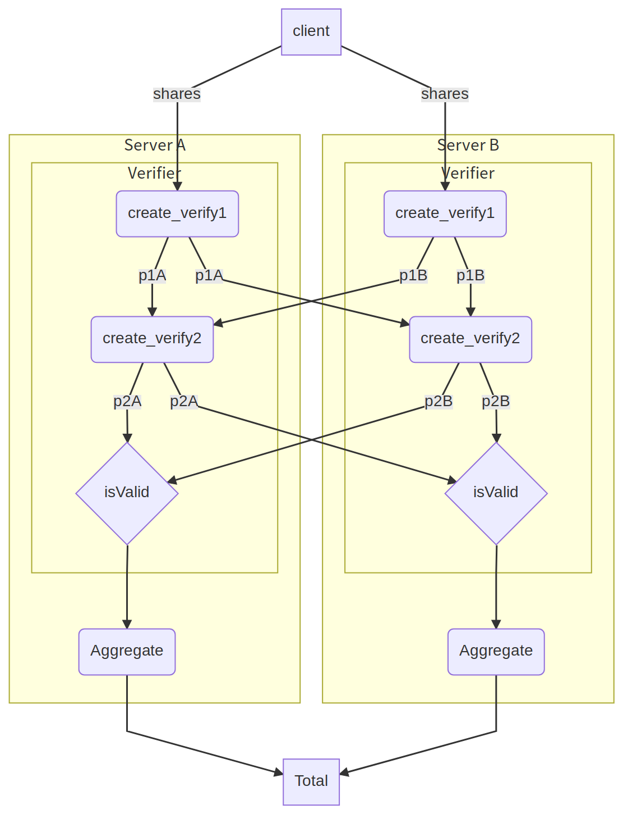

# asyncio Example Usage

This example demonstrates usage of the python wrapper using asyncio. 

## Running the example

```bash
docker run -v $(pwd):/app -it prio:dev python3 main.py
```

Results in:

```bash
INFO:root:Starting asyncio prio pipeline.
INFO:root:Client 0: Generate shares
INFO:root:Client 1: Generate shares
INFO:root:Client 2: Generate shares
INFO:root:Client 3: Generate shares
INFO:root:Server 1, PID 0: Generate verify packet 1
INFO:root:Server 0, PID 0: Generate verify packet 1
INFO:root:Server 0, PID 1: Generate verify packet 1
INFO:root:Server 0, PID 2: Generate verify packet 1
INFO:root:Server 1, PID 1: Generate verify packet 1
INFO:root:Server 0, PID 3: Generate verify packet 1
INFO:root:Server 0, PID 0: Generate verify packet 2
INFO:root:Server 1, PID 2: Generate verify packet 1
INFO:root:Server 0, PID 1: Generate verify packet 2
INFO:root:Server 0, PID 2: Generate verify packet 2
INFO:root:Server 1, PID 3: Generate verify packet 1
INFO:root:Server 0, PID 3: Generate verify packet 2
INFO:root:Server 1, PID 0: Generate verify packet 2
INFO:root:Server 0, PID 0: Aggregate data
INFO:root:Server 1, PID 1: Generate verify packet 2
INFO:root:Server 0, PID 1: Aggregate data
INFO:root:Server 1, PID 2: Generate verify packet 2
INFO:root:Server 0, PID 2: Aggregate data
INFO:root:Server 1, PID 3: Generate verify packet 2
INFO:root:Server 0, PID 3: Aggregate data
INFO:root:Server 1, PID 0: Aggregate data
INFO:root:Server 1, PID 1: Aggregate data
INFO:root:Server 1, PID 2: Aggregate data
INFO:root:Server 1, PID 3: Aggregate data
INFO:root:Done!
```

## Dataflow diagram



```mermaid
graph TD

client -->|shares| create_p1A(create_verify1)
subgraph Server A
    subgraph Verifier
        create_p1A --> |p1A| create_p2A(create_verify2)
        create_p2A --> |p2A| isvalid_A{isValid}
    end
    isvalid_A --> aggregate_A(Aggregate)
end 

create_p1A --> |p1A| create_p2B
create_p2A --> |p2A| isvalid_B


client -->|shares| create_p1B(create_verify1)
subgraph Server B
    subgraph Verifier
        create_p1B --> |p1B| create_p2B(create_verify2)
        create_p2B --> |p2B| isvalid_B{isValid}
    end
    isvalid_B --> aggregate_B(Aggregate)
end 

create_p1B --> |p1B| create_p2A
create_p2B --> |p2B| isvalid_A


aggregate_A --> Total
aggregate_B --> Total
```
